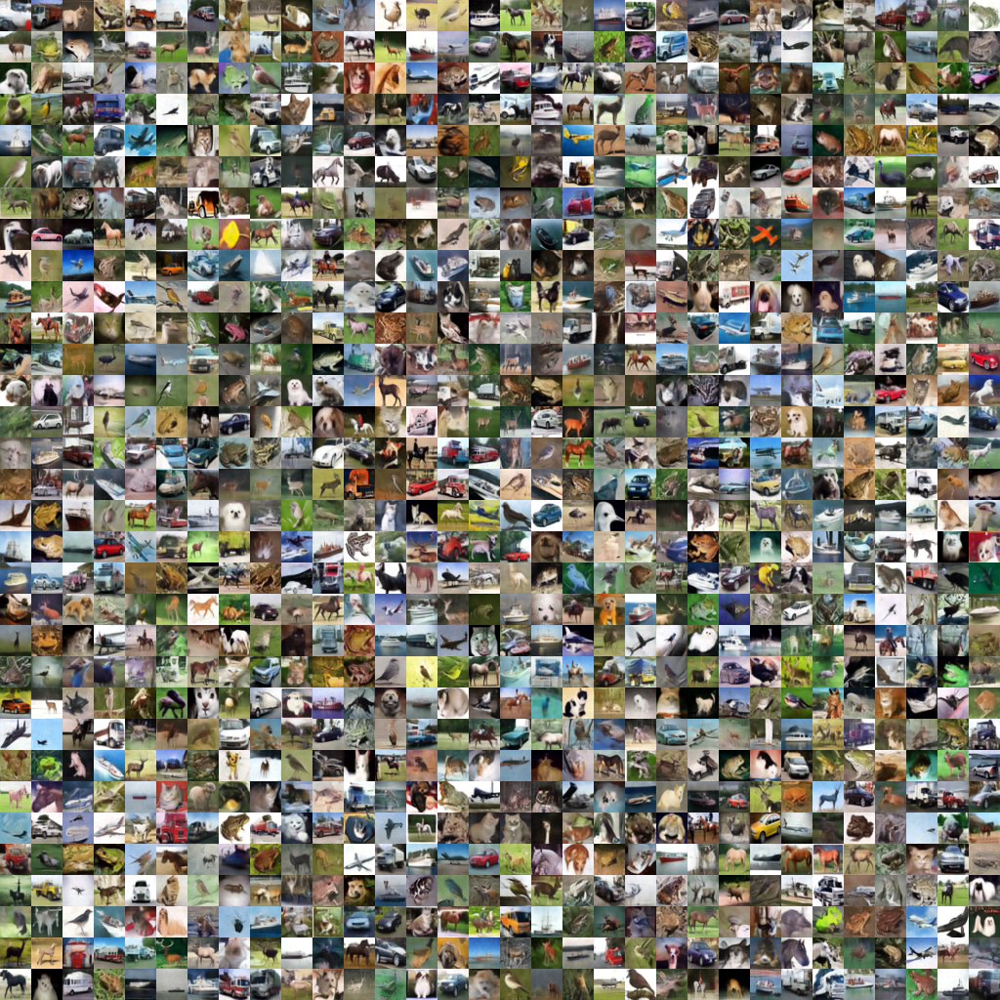

# Torch MeanFlow 🌊

*A clean PyTorch implementation of the paper ["Mean Flows for One-step Generative Modeling"](https://arxiv.org/abs/2505.13447) by Geng et al, with on-the-fly FID evaluation.*

Our goal is to provide a straightforward and clean **PyTorch implementation** of Mean Flow models for CIFAR-10 and MNIST, such that researchers can conduct experiments with minimal costs.

---

## 🚀 Features
- 🧹 **Clean implementation** - Well-structured PyTorch codebase
- 📊 **Real-time FID** - Evaluation during training
- ⚡ **Optimized** - Multi-GPU training support
- 📝 **Documented** - Comprehensive docstrings and comments
- 🧠 **Detailed explanation** - A Jupyter notebook that walks you through every detail in Mean Flows.

## 👨‍💻 Core Contributors
| Researcher | Affiliation | Contact |
|------------|-------------|---------|
| **Weijian Luo** | Humane Inellegence (hi) Lab, Xiaohongshu Inc && Peking University | [📧](mailto:pkulwj1994@icloud.com) |
| **Yifei Wang** | Rice University | [📧](mailto:yw251@rice.edu) |


## 💌 Call for Feedback
We welcome your input! Please reach out if you:
- Find any issues running the code
- Have suggestions for improvements
- Want to collaborate on extensions

[](mailto:pkulwj1994@icloud.com)
[](mailto:yw251@rice.edu)


## Environment Setup

```
conda env create -f environment.yml
conda activate easy_meanflow
```

## Preparing datasets

We prepared our dataset following the instructions in [StyleGAN](https://github.com/NVlabs/stylegan3).

CIFAR10 dataset can be downloaded through
```
wget https://huggingface.co/datasets/william94/useful_public_data/resolve/main/cifar10-32x32.zip
```

To calculate FID score, you will also need to compare the generated images against the same dataset that the model was originally trained with. To facilitate evaluation, use the exact reference statistics of [EDM](https://github.com/NVlabs/edm/tree/main?tab=readme-ov-file), which can be found at: [https://nvlabs-fi-cdn.nvidia.com/edm/fid-refs/](https://nvlabs-fi-cdn.nvidia.com/edm/fid-refs/).


## Getting started
A good way to start is to play with our [Colab notebook](https://colab.research.google.com/drive/1dQR09kiFx4yvUO6ENvC5S1K16-oQ6DZc?usp=sharing). We will walk you through the details of mean flow and train a toy model on MNIST.

After that, if you want to train a meanflow model on CIFAR10, simply run:

```
sh ./exps/MF00/train_script.sh
```
FID score is computed on the fly.

## Calculating FID

We also provide scripts for computing Fr&eacute;chet inception distance (FID), simply run:
```
sh cal_fid.sh
```

## Results on CIFAR10


## Acknowledgements
We are thankful to the authors of the [meanflow](https://arxiv.org/abs/2505.13447), as well as their [Jax implementation](https://github.com/Gsunshine/meanflow).

We extend our gratitude to the authors of the EDM paper for sharing their code, which served as the foundational framework for developing this repository. The repository can be found here: [NVlabs/edm](https://github.com/NVlabs/edm/). We also refer to some basic logics of the Diff-Instruct repo [pkulwj1994/diff_instruct](https://github.com/pkulwj1994/diff_instruct).
